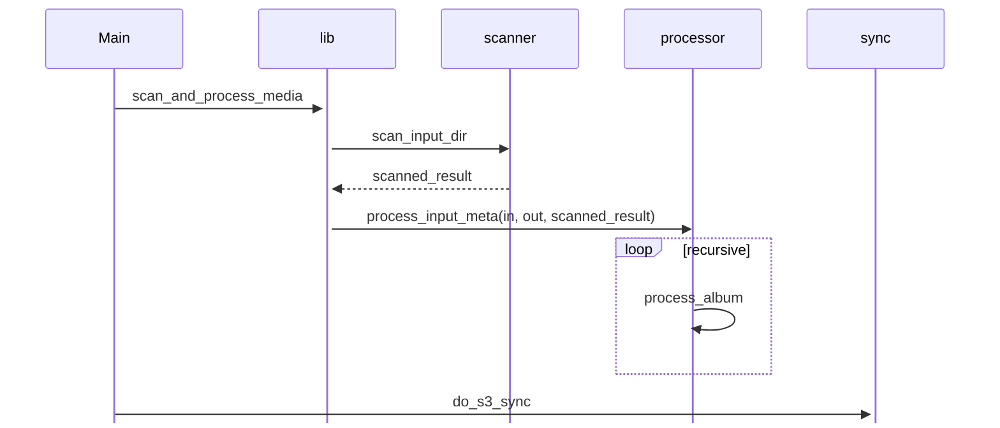

# Kaliatech Media Processor

Services for photo ingestion and publishing on kaliatech website. Written entirely in Rust. Only external dependency is
FFMPEG.

- Scans an input directory recursively looking for all photo and video files
- Resizes and transcodes files to a web friendly format and in multiple resolutions
- Generates a JSON file with metadata for each file and album (directory) of files
- Synchronizes all output files and metadata json files to AWS S3
- Can be run multiple times. Results are idempotent. Only new or changed files are processed.

## Rough Sequence



## Command Line Reference

```
Usage: kt-media-processor [OPTIONS] --inDir <IN_DIR> --outDir <OUT_DIR>

Options:
  -i, --inDir <IN_DIR>            Input directory
  -o, --outDir <OUT_DIR>          Output directory
  -a, --awsProfile <AWS_PROFILE>  AWS profile name (optional)
  -s, --s3Url <S3_URL>            AWS S3 URL for automatic sync with delete (optional)
  -h, --help                      Print help
  -V, --version                   Print version

```

## Command Line Example

Using Cargo

```shell
cargo run --color=always --release \
  --package kt-media-processor \
  --bin kt-media-processor -- \
  -i ../kt-media-root \
  -o ../kt-media-root-processed \
  -a kt-media-processor \
  -s s3://kaliatech-media/kt-processor-test1/
```